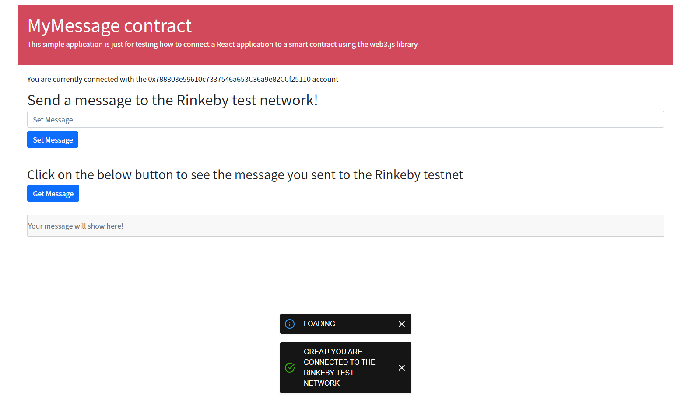
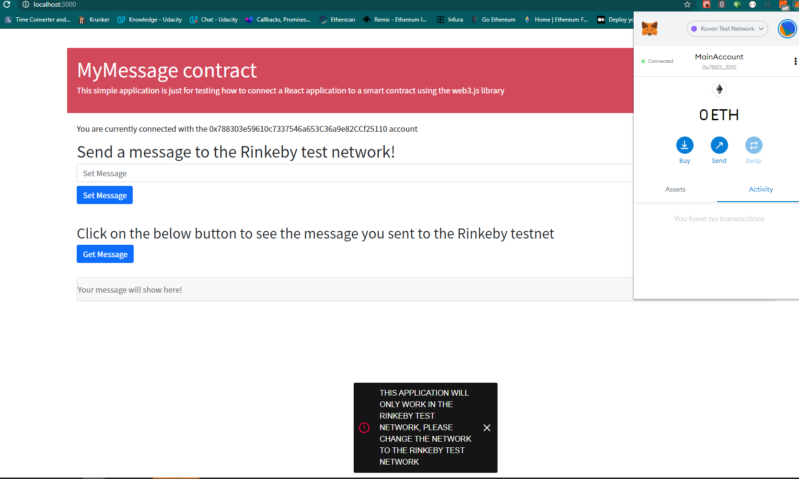
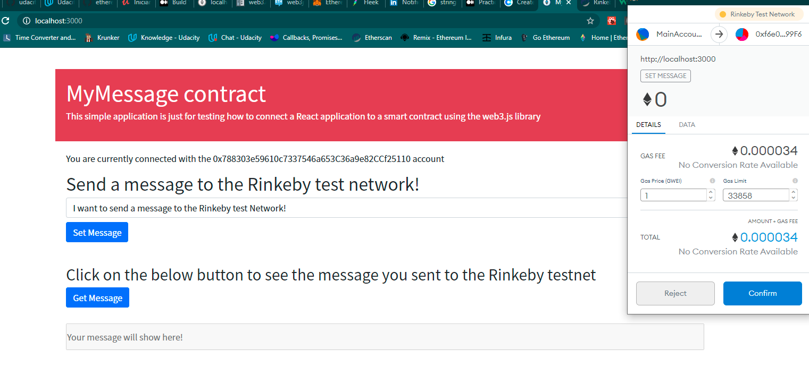
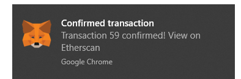
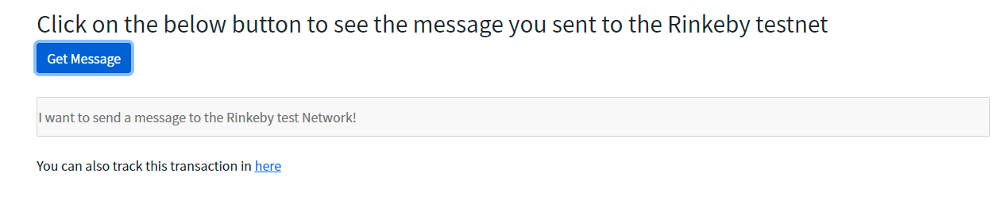

# How to connect a React Application to a smart contract deployed to the Rinkeby TestNetwork

###

```
Truffle v4.1.14 (core: 4.1.14)
Solidity v0.4.24 (solc-js)
Node v12.0.0
web3@1.3.4
react v17.0.2
```

### Smart Contract deployed to the Rinkeby Test Network

- Contract Address 0xf6e09b77560702d07472889472ab972735e699f6
- Contract Deployed using Infura
- Truffle development suite used for development

### React Hooks have been used, Context API has been used for state management

This app will detect two very important changes :exclamation: :exclamation:

- If the user changes his metamask account and if he changes to another network other than Rinkeby



If the user sets metamask to use another network an error message will be shown



After sending a message, metamask will open asking for the user to check the gas cost and to confirm





Finally the user will be able to get the message from the Rinkeny test network,
:exclamation: as this is a read only function in the smart contract it will not create any cost :exclamation:



<br /> Made by Antonio Salazar. 😘 (to be published as a Medium article)
